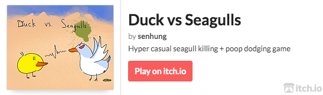

> You, a righteous duck, should keep the cleanliness of the beach. Kill the pooping seagulls!

    

## Controls

|   Action   |    Key     |
| :--------: | :--------: |
| Move Left  |    A, ←    |
| Move Right |    D, →    |
|    Jump    |    W, ↑    |
|   Attack   | Mouse Left |

- Avoid seagulls poop.
- When you kill a seagull, **double jump** is reset and **attack cooldown** is largely reduced.
